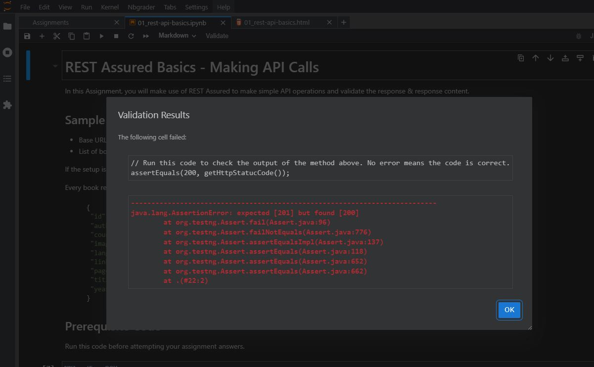
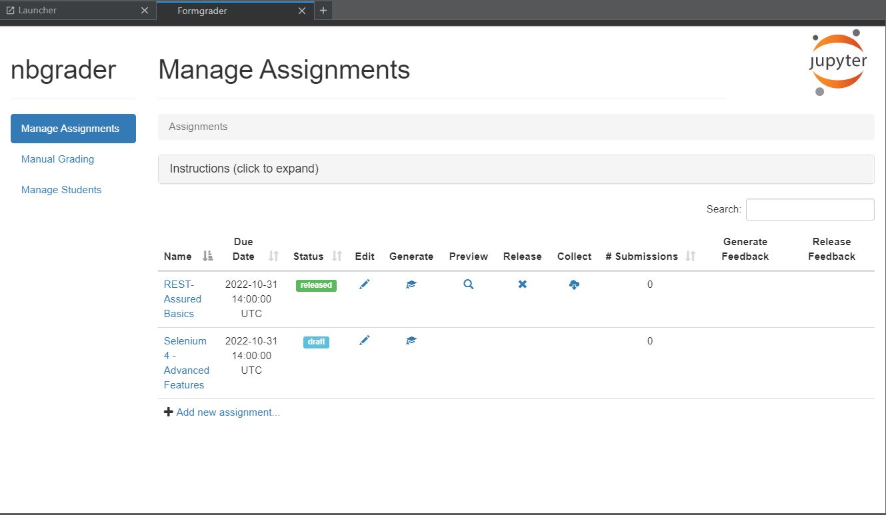
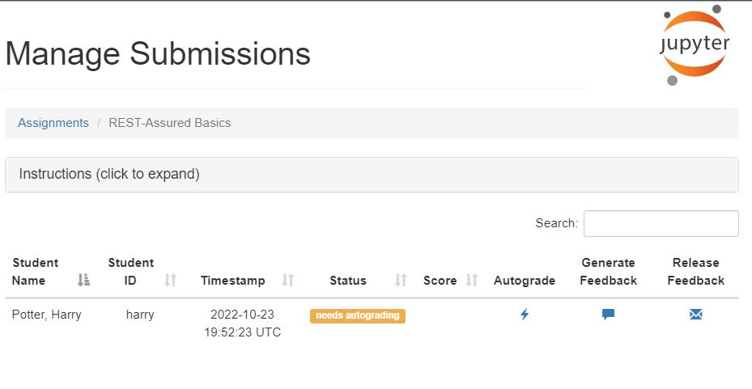
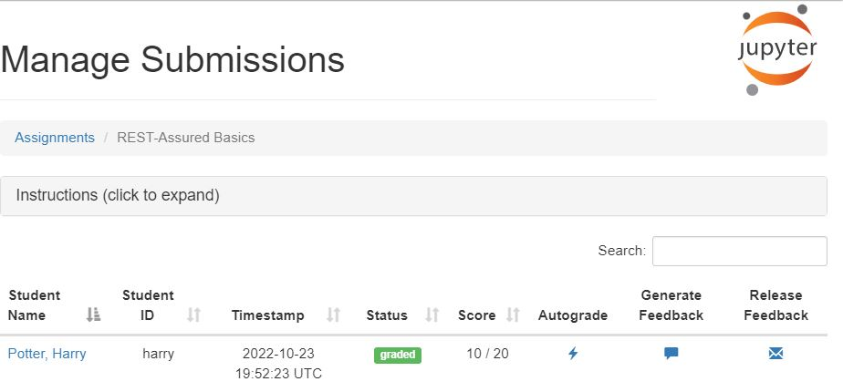

# Upskill Server

Upskill server Docker image is a fun way to define Test Automation Coding Assignments and publish them to your team or a group of enthusiasts. They can complete the assignment and submit their answers which can be auto-evaluated and scored with an option of manual grading as well.

## How to use the Upskill Server?
You can use the Upskill Server as an Instructor or as a Student.

__As an Instructor, you can__

- Define assignments (Optionally set deadlines for submission)
- Add coding questions to the assignments and assign the marks to them
- Release Assignments to students
- Evaluate students' submissions with a single-click Auto-Evaluation
- Manually evaluate students' submissions
- Generate the score cards for Students

__As a student, you can__

- Pull the assignments released by the instructor
- Work on the assignment questions by writing code
- Write/edit/run code using the In-Browser IDE
- Evaluate the answers before submitting the assignment
- Submit the assignment
- See the score when the Instructor evaluates your assignment
- See the review comments given by your Instructor

## What is an assignment?

- Every assignment is a set of questions
- Instructor can define a set of `tests` that will be used by Auto-Evaluator to evaluate the answers
- The `tests` can be exposed, kept hidden or exposed partially with the students as decided by the Instructor
- Answering questions involves writing code to solve the problem given in the assignment
- Assignment can have a setup step that defines prerequisites needed to complete the assignment
- Assignments have `Evaluate` button that the students can use to evaluate their answers before submitting

## What is this demo about?

This is a quick demo of how to use the Upskill-Server for defining assignments for your teams in a fun way. This demo has one sample assignment on the topic of API testing using `REST-Assured` tool.

When you run the demo, 2 containers start running. One is the `Upskill Server`. The other is the `API-Server` used as dummy/mock APIs to be used by students to solve the questions in the assignment.

## How to run the demo in 3 easy steps in 10 minutes?!

__Prerequisite - Docker is installed on your machine__
1. Clone the git repository https://github.com/dineshvelhal/upskill-server-demo
```bash
git clone dineshvelhal/upskill-server-demo
cd upskill-server-demo
```
2. Start the containers using the `docker-compose` command
```bash
docker-compose up
```

docker-compose file contents:
```
version: '3.3'

services:
  upskill-server:
    image: "dineshvelhal/upskill-server:latest"
    container_name: "upskill-server"
    networks:
      - upskill_net
    ports:
      - "8000:8000"

  api-server:
    image: "dineshvelhal/json-server-demo:latest"
    container_name: "api-server"
    networks:
      - upskill_net
    ports:
      - "80:80"

networks:
  upskill_net:
```

This demo comes with 4 user accounts - one Instructor and 3 Students
- __albus__ - Instructor
- __harry__ - Student
- __ron__ - Student
- __hermione__ - Student

3. set the passwords for all 4 accounts. 
For this you need to start a shell in the Upskill-Server container and set the user passwords using the `passwd` command. This is a one time activity.
```bash
docker exec -ti upskill-server bash
passwd albus
passwd harry
password ron
passwd hermione
```
Please note that the `passwd` command is interactive so you need to set the passwords by entering them twice for each user.

Well Done! now you are all set to use the Upskill server. Open the upskill server URL ([Upskill Server](http://localhost:8000)) in a browser and log in using the Instructor or Student account. The Mock APIs to be used for the assignments can be accessed by opening the URL [API Server](http://localhost:80)

When you log in as an Instructor, you will see a sample assignment is available in home directory. You can use it to get yourself familiar with Upskill Server.

### Upskill server is based on a set of awesome Open-Source tools available for general use.

- [NBGrader](https://github.com/jupyter/nbgrader) - A system for assigning and grading Jupyter notebooks.
- [Jupyter Notebooks](https://github.com/jupyter/notebook) - web-based notebook environment for interactive computing
- [Jupyterhub](https://github.com/jupyterhub/jupyterhub) - a multi-user environment for Jupyter Notebooks
- [Jupyter Lab](https://github.com/jupyterlab/jupyterlab) - a next generation IDE for Jupyter Notebooks
- [IJava Kernel for Jupyter Notebooks](https://github.com/SpencerPark/IJava) - A Jupyter kernel for executing Java code in Jupyter Notebooks

### How to use NBGrader for setting / using assignments?

- [Overview](https://nbgrader.readthedocs.io/en/stable/user_guide/highlights.html)
- [NBGrader Documentation](https://nbgrader.readthedocs.io/en/stable/)

### Please note - This demo is only for local use. Please don't host it on public facing server or in Production environment.

### Sample Screenshots
- Assignment (Student's view)


- Self-validation by student before submitting the assignment


- __Manage Assignmets__ view for Instructor


- Ealuate assignment view of the Instructor


- Ealuated assignment view

